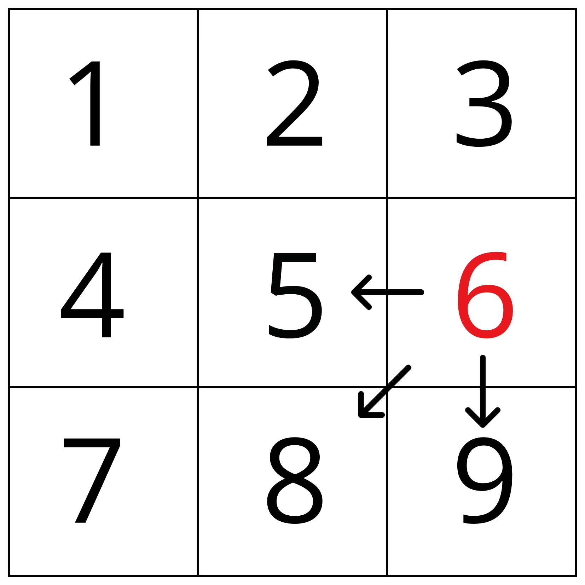

# **O Caminho Guloso**

Atividade para a disciplina de Algoritmos e Estruturas de dados I. <br/>
O objetivo é desenvolver um algoritmo que utiliza a estratégia gulosa para tomar decisões, a partir da entrada de valores de uma matriz contidas em um arquivo.

### **Introdução** <br/>
A estratégia gulosa de projeto de algoritmos constrói a resolução peça por peça, faz escolhas que oferecem maior benefício localmente a cada iteração, sem voltar atrás de qualquer escolha. Orientado a aplicações de otimização do programa, a estratégia gulosa tem como objetivo encontrar a melhor resposta para cada passo. <br/>
Uma matriz é um tipo de tabela, que representa e organiza dados por meio de linhas e colunas. <br/>

O projeto apresentado foi feito na **linguagem C++**, consiste em caminhar por uma matriz de números inteiros positivos, o qual o percurso é feito sempre optando pelo maior número com base nas opções disponíveis até chegar na última posição de cada matriz, sem visitar novamente lugares já percorridos. O algoritmo deve também realizar a soma dos números pertencentes ao caminho de cada matriz. 

### **Arquivo**

- Para o desempenho correto, é preciso a inicialização do arquivo contendo sempre ao menos uma matriz, contendo o tamanho dela na primeira linha dele.
- O arquivo de entrada deve ser sempre de números inteiros positivos. 
- Os valores contidos no arquivo não são alterados durante o funcionamento do código. 
- Ele contém em sua primeira linha o tamanho que as matrizes vão ter e todas devem ser com esse mesmo tamanho, sendo também matrizes quadradas, ou seja, o número de colunas é igual ao de linhas. 
- As matrizes são separadas umas das outras através de uma linha vazia no arquivo.<br/> 


### **Lógica**


- ```Função tamanho``` : Tem o objetivo de fazer a leitura da primeira linha e descobrir qual a dimensão das matrizes. Esse tamanho inicialmente descoberto será usado para fazer a alocação dinâmica de cada uma.
- ```Função transformar```: A matriz é lida linha por linha e salva como uma matriz de string e em seguida convertida para uma matriz de inteiros, para ser possível realizar a soma do percurso.

- ```Função caminhar```: É a responsável pelo caminho do algoritmo. <br/>
O percurso de cada matriz se inicia na posição [0,0] e é finalizado na posição [tamanho][tamanho]. <br/>
Em cada iteração o algoritmo verifica primeiro se é possível acessar uma determinada posição, para que ele não visite lugares vazios.  
Caso seja possível, ele olha qual posição possui o número maior.

  A ordem de verificação é:
  1. Para direita (n° 6)
  2. Para diagonal direita (n° 9)
  3. Para diagonal esquerda (n° 7)
  4. Para esquerda (n° 4)
  5. Para baixo (n° 8)

Exemplo ilustrativo para a ordem de verificação:        


  De acordo com a posição que o algoritmo estiver, nem sempre será uma possibilidade as 5 direções. Por exemplo, se o algoritmo estiver na posição [1][2], ocupada pelo algarismo 6, ele não tem a opção de ir para direita ou para diagonal direita, pois são posições nulas que não pertencem a matriz. 

  

  O trajeto realizado por cada matriz é alterado pelo valor (-1), para registrar o percurso.
  O caminhamento é dado pela última direção visitada que cumpri os critérios abordados. Em casos com números iguais, a escolha é feita sempre pelo último comando que o algoritmo entrou, de acordo com a ordem apresentada.
 
 
- ```Função resultado``` : Ao final da execução do código é revelado a soma total do percurso de todas as matrizes juntas.
- ```Função imprimir``` : Responsável por mostrar a matriz.

O programa é efetuado até todas as matrizes serem lidas, e através da variável "contador" ele conta a quantidade de matrizes.


### **Exemplo de compilação:**

Durante a execução do programa é mostrado: 

- A matriz lida naquele instante<br/>
- Todos os números do caminho realizado<br/>
- A soma individual do caminho dessa matriz<br/>
- A alteração das posições visitadas por (-1)<br/>
- No final, a soma total do caminho de todas as matrizes<br/>
<br/>


<br/>

### Compilação e Execução

Esse pequeno exemplo possui um arquivo Makefile que realiza todo o procedimento de compilação e execução. Para tanto, temos as seguintes diretrizes de execução:


| Comando                |  Função                                                                                           |                     
| -----------------------| ------------------------------------------------------------------------------------------------- |
|  `make clean`          | Apaga a última compilação realizada contida na pasta build                                        |
|  `make`                | Executa a compilação do programa utilizando o gcc, e o resultado vai para a pasta build           |
|  `make run`            | Executa o programa da pasta build após a realização da compilação                                 |
