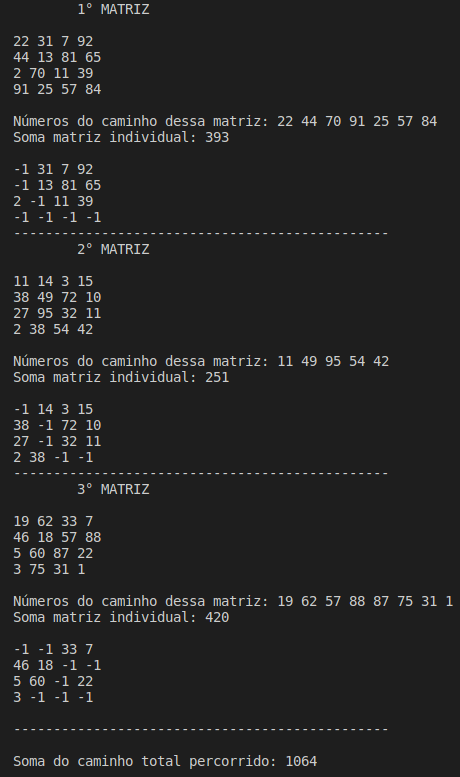

# **O Caminho Guloso**

Atividade para a disciplina de Algoritmos e Estruturas de dados I.

### **Introdução**
O método guloso de projeto de algoritmos constrói a resolução peça por peça, faz escolhas que oferecem maior benefício localmente a cada iteração, sem voltar atrás de qualquer escolha. Orientado a aplicações de otimização do programa, a estratégia gulosa tem como objetivo encontrar a melhor resposta para cada passo.  
Uma matriz é um tipo de tabela, que representa e organiza dados por meio de linhas e colunas.    
O projeto apresentado foi feito na **linguagem C++**, consiste em caminhar por uma matriz de números inteiros positivos, o qual o percurso é feito sempre optando pelo maior número com base nas opções disponíveis até chegar na última posição de cada matriz, sem visitar novamente lugares já percorridos.

### **Estrutura**

matriz.hpp -> Inclui a classe "Matriz" com intuito de chamar todas as funções utilizadas e seus parâmetros.  matriz.cpp -> Contém a criação e o desenvolvimento das funções e da lógica que rege o programa .   main.cpp -> Pertence a parte de declaração de variáveis, alocação dinâmica das matrizes e chamada das funções executadas, através do construtor da classe.  
input.data -> O arquivo que contém as matrizes utilizadas.  

### **Arquivo**

- Para o desempenho correto, é preciso a inicialização do arquivo contendo sempre ao menos uma matriz, contendo o tamanho dela na primeira linha dele.
- O arquivo de entrada, deve ser sempre de números inteiros positivos, entretanto, na saída o caminho percorrido é alterado pelo valor (-1). 
- Ele contém em sua primeira linha o tamanho que as matrizes vão ter e todas devem ser com esse mesmo tamanho, sendo também matrizes quadradas, ou seja, o número de colunas é igual ao de linhas. 
- A função "tamanho" tem o objetivo de fazer a leitura da primeira linha e descobrir qual a dimensão das matrizes.
- Elas são separadas por uma linha vazia no arquivo.  

### **Lógica**

O tamanho das matrizes inicialmente descoberto será usado para fazer a alocação dinâmica de cada uma, que são lidas no formato string e em seguida convertidas para uma matriz de algarismos inteiros, para ser possível realizar a soma do percurso, procedimento realizado na função "transformar".

A função "caminhar" é a responsável pelo caminho do algoritmo.  
O percurso de cada matriz se inicia na posição [0,0] e é finalizado na posição [tamanho][tamanho].  
Em cada iteração o algoritmo verifica primeiro se é possível acessar uma determinada posição, para que ele não visite lugares vazios.  
Caso seja possível, ele olha qual posição possui o número maior.

A ordem de verificação é:
1. Para direita (n° 6)
2. Para diagonal direita (n° 9)
3. Para diagonal esquerda (n° 7)
4. Para esquerda (n° 4)
5. Para baixo (n° 8)

Exemplo ilustrativo para a ordem de verificação:        

De acordo com a posição que o algoritmo estiver, nem sempre será uma possibilidade as 5 direções. Por exemplo, se o algoritmo estiver na posição [1][2], ocupada pelo algarismo 6, ele não tem a opção de ir para direita ou para diagonal direita, pois são posições nulas que não pertencem a matriz. 

O caminhamento é dado pela última direção visitada que cumpri os critérios abordados. Em casos com números iguais, a escolha é feita sempre pelo último comando que o algoritmo entrou, de acordo com a ordem apresentada.

- Todos os números do percurso de cada matriz são somados individualmente e mostrados para o usuário.
- O programa é efetuado até todas as matrizes serem lidas, e através da variável "contador" ele conta a quantidade de matrizes.
- Ao final da execução do código é revelado a soma total do caminho de todas as matrizes do arquivo.  

### **Exemplo de compilação:**

Durante a execução do programa é mostrado: 

- A matriz lida 
- Todos os números do caminho realizado 
- A soma individual do caminho dessa matriz 
- A alteração das posições visitadas por (-1) 
- No final, a soma total do caminho de todas as matrizes 
 

 

### Compilação e Execução

Esse pequeno exemplo possui um arquivo Makefile que realiza todo o procedimento de compilação e execução. Para tanto, temos as seguintes diretrizes de execução:

| Comando                |  Função                                                                                           |                     
| -----------------------| ------------------------------------------------------------------------------------------------- |
|  `make clean`          | Apaga a última compilação realizada contida na pasta build                                        |
|  `make`                | Executa a compilação do programa utilizando o gcc, e o resultado vai para a pasta build           |
|  `make run`            | Executa o programa da pasta build após a realização da compilação                                 |